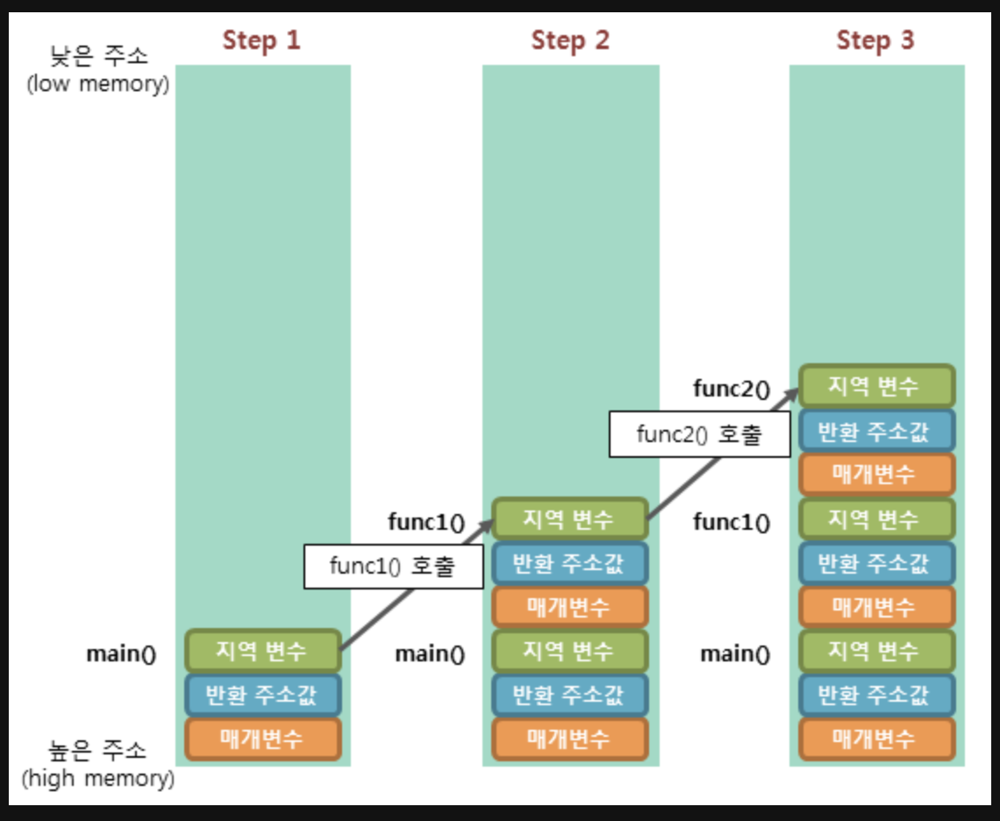

## 재귀 함수

- 함수가 직/간접적으로 자기 자신을 호출하는 함수를 재귀함수라고 한다.
- 반복문과 유사하게 동작하며, 반복문을 사용하는 코드는 항상 재귀 함수를 통해 구현하는 것이 가능하다.(그 반대도 가능하다.)
- 재귀 함수는 함수 내에서 자신을 호출한 후 호출한 함수가 끝날 때 까지 함수 호출 이후의 명령문이 수행되지 않는다.
- 반복문과 마찬가지로 종료 지점을 명확하게 생각하고 구현해야 무한루프를 방지할 수 있다.

```js
function printNumber(n) {
  function DFS(L) {
    if (L === 0) return
    else {
      DFS(L - 1)
      console.log(L)
    }
  }
  DFS(n)
}
printNumber(3)
```

- DFS(3)-DFS(2)-DFS(1)-return(종료)-console.log(1)-console.log(2)-console.log(3) 순서대로 동작한다.
- DFS(1)까지 간 후 함수가 종료되면 그 다음의 console.log()가 순차적으로 실행되고 함수가 순서대로 종료되는 것이다.
- 이러한 동작은 함수 호출 시 함수의 지역변수, 매개변수, 복귀 주소 등이 저장되는 공간인 스택 프레임을 이용해 이루어진다.

## 스택 프레임

- 함수가 호출될 때 그 함수만의 스택 영역을 구분하기 위하여 생성되는 공간이다.
- 함수 호출 시 할당되며 함수가 종료되면 소멸한다.
- 함수가 호출되면 스택에 함수의 매개변수, 호출이 끝난 뒤 돌아갈 복귀 주소값, 함수의 지역변수 등이 저장된다.
- 스택에 차례대로 저장되는 함수의 호출 정보를 스택 프레임이라고 한다.
- 재귀 함수도 함수이므로 호출 정보가 스택 프레임에 저장된다.



- 함수가 return을 하는 순간 스택 프레임에서는 pop이 일어나고 함수는 종료된다.
- 종료된 함수는 스택에서 사라지고, 해당 함수의 복귀 주소로 실행이 넘어간다.

위 예제의 재귀 함수의 스택프레임은 아래와 같이 동작한다.

1. [{DFS(3),복귀 주소:DFS(3)의 4번째줄},{DFS(2),복귀 주소:DFS(2)의 4번째줄},{DFS(1),복귀 주소:DFS(1)의 4번째줄}] 대략 이런 형태로 스택이 쌓인다.
2. DFS(0)이 되는 순간 return을 만나고, 함수가 종료되면서 DFS(1)로 넘어간다.
3. DFS(1)의 복귀주소였던 4번째 줄부터 실행된 후 함수가 종료되고, DFS(1)은 pop을 한다.
4. DFS(2)의 복귀 주소였던 DFS(2)의 4번째 줄부터 실행이 재개된다.
5. DFS(2)의 실행을 마치고 pop이 된 다음, DFS(3)의 4번째 줄부터 실행이 재개된다.

- 순서대로 동작하다보면 console.log()는 1-2-3의 순서로 숫자를 출력하게 된다.
- 만약 역순으로 출력하고 싶다면, console.log()의 위치를 함수를 호출하는 위치의 위로 옮기면 된다.
- 콘솔 출력 후 자신을 호출하기 때문에 3-2-1 순서로 출력하게 된다.
