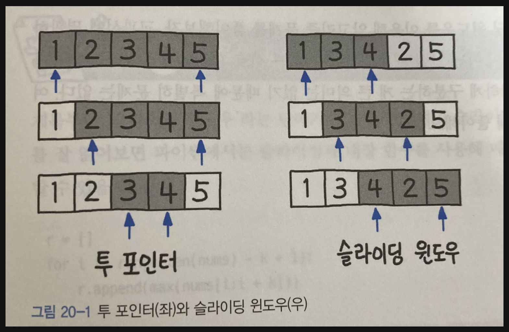

## 투포인터 알고리즘
- 어떤 특정 조건을 만족하는 연속 구간을 구할 때 O(N) 으로 풀 수 있도록 도와주는 알고리즘이다.

- 2 개의 포인터를 사용하여 구간의 길이를 가변적 적으로 잡아가며 특정 조건을 만족하는 구간을 찾는다.
- 모든 연속 구간을 잡는다면 O(N^2)이 될 것이지만 투 포인터 알고리즘을 사용하면 O(N) 의 시간복잡도로 풀 수 있다.
- 두 포인터 각각 N번 움직이기 때문에 N + N = 2N 번의 연산이 있는 셈이다. 즉, O(2N) = O(N) 이 된다.
- 어떤 구간을 찾는 문제일 때 입력 크기가 아주 크다면 투 포인터 알고리즘 을 고려하여 푸는 것이 좋다.
- 2 개의 포인터 중 right 포인터는 어떤 조건일 때 증감시키고, left 포인터는 어떤 조건일 때 증감시킬지 결정해야 한다.

### 투포인터 알고리즘 문제의 유형
- 포인터 2개가 같은 방향으로 진행하는 유형
- 포인터 2개가 양끝에서 시작하여 반대로 진행하는 유형
- 포인터 하나는 한쪽 방향으로만 진행하고, 다른 포인터는 양쪽으로 이동하는 유형

## 슬라이딩 윈도우
- 고정 사이즈의 윈도우가 이동하면서 윈도우 내에 있는 데이터를 이용해 문제를 풀이하는 알고리즘을 말한다.
- 배열이나 리스트의 요소의 일정 범위의 값을 비교할때 사용하면 매우 유용하다.
- 원래 네트워크에서 사용되던 알고리즘을 문제풀이에 응용한 경우라고 할 수 있다.

