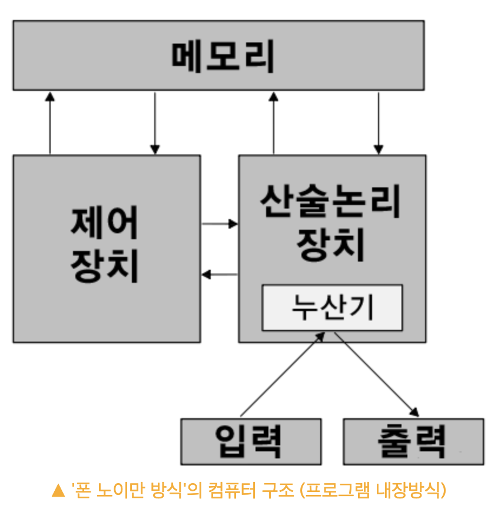

## 컴퓨터의 논리와 구조

> 완성된 장치가 범용 컴퓨팅 기계가 되려면 산술 연산, 기억-저장, 제어, 운영자와의 연결을 담당하는 특정 주요 기관을 포함해야 한다. - 폰 노이만

### 폰노이만은 누구인가

- CPU, 메모리, 프로그램 구조를 갖는 범용 컴퓨터 구조를 확립했다.
  

### 컴퓨터가 무엇인지

- 논리적 구성 (기능적 구성)
  - 컴퓨터가 어떤 부분들로 이루어져 있고 무슨 일을 하며 어떻게 연결되는지에 주목한다.
- 물리적 구조
  - 각 부분이 어떻게 생겼고 어떻게 만들어지는지를 나타낸다.

### 컴퓨팅이란

- 원래 컴퓨팅은 계산을 의미했다.
- 컴퓨터는 계산을 하는 사람이란 뜻이었다.
- 전기적 컴퓨터가 출현하면서 이를 사용하는 행위 또한 가리키게 되었다.
- 계산을 수행하는 전기적 과정은 컴퓨터 하드웨어에서 수행되었다.
- 컴퓨터에서 실행하기 위한 프로그램을 제작하는 이론적 개념이 아니라 컴퓨터 과학의 일부분으로써 수학적 계산을 수행한다는 원래의 의미에도 대응한다.
- 컴퓨터 기술 자원을 개발 및 사용하는 모든 활동을 가리키기도한다.

### 컴퓨팅 장치

- 대부분은 PC의 한 종류를 갖고 있을 것이다.
- 노트북 또는 데스크톱 컴퓨터로 마이크로소프트가 만든 윈도우 운영체제를 실행한다.
- 맥OS 운영체제를 실행하는 매킨토시 컴퓨터가 있다.
- 크롬OS 운영체제로 실행하는 크롬북이 있다.
- 장치들은 모두 다르게 생겼고 사용하는 느낌도 다르지만 내부 작동 원리는 근본적으로 똑같다.
- 논리적 구성면에서 오늘날의 컴퓨터는 1950년대의 컴퓨터와 매우 유사하지만 물리적인 차이는 많은 변화가 있다.

```
예를 들어
- 자동차를 기능적으로 보자면 :
  차를 움직이는 엔진과 연료를 저장하는 연료탱크, 차를 제어하는 핸들이 달려있으며, 탑승자와 짐이 들어갈 공간이 있다.

- 자동차를 물리적으로 보자면 :
  고성능 엔진으로 빠르게 달릴 수 있거나, 에어백과 범퍼가 더 안전하거나, 짐을 많이 실을 수 있는 트렁크가 크다거나 하는 물리적 속성이 있다.
```

### 네트워크 효과란

- 더 많은 사람들이 특정 상품을 사용할 경우, 그 가치가 상승하는 것이다.

### 운영체제란

- 컴퓨터를 동작 시키는데 도움을 주는 소프트웨어이다.

- 컴퓨터 사용자가 하드웨어 자체를 다룬다는 것은 쉽지 않은 일이기 때문에 기본적으로 컴퓨터에 운영체제를 탑재하는 것이다.

- 컴퓨터 하드웨어 바로 윗단에 설치되는 소프트웨어로 하드웨어 + 운영체제를 컴퓨터 시스템이라고 부른다.
