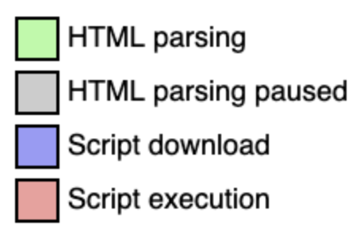
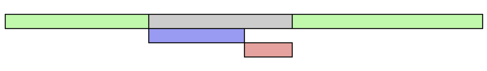
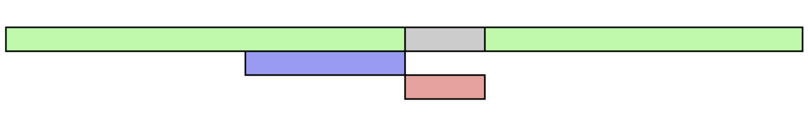
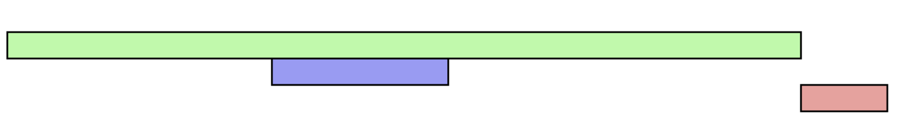

## `<script>` & `<script async>` & `<script defer>` 실행순서


## `<script>`


- 자바스크립트는 parser blocking resource(파서 차단 리소스)이다.
- async, defer 모두 사용하지 않은 기본 모드로 브라우저는 문서를 파싱해 읽다가 자바스크립트를 만나면 진행하고 있었던 파싱을 멈추고 스크립트를 다운 -> 파싱 -> 실행한 후 다시 문서를 파싱하게 된다.
- 스크립트는 인라인으로 선언된 경우, 파싱되고 실행되지만 외부 스크립트의 경우 다운로드한 후 파싱하고 실행된다.
- 기본모드를 사용할 경우 스크립트를 다운 / 파싱 / 실행할 때까지 문서(Html)파싱이 중단돼 화면 랜딩 시간이 더 소요된다.


## `<script async>`


- async 속성을 쓰면 문서를 파싱하는 동안 스크립트를 만나면 무서 파싱과 함께 스크립트를 다운받고 스크립트 다운이 완료되면 즉시 스크립트를 실행하게 된다.
- 다운로드가 끝나고 스크립트를 실행하는 동안 문서(Html) 파싱은 멈추고 스크립트 실행이 끝난 후 남은 문서를 읽는다.
```html
<script src="async3.js" async> // 스크립트 다운로드 시간이 3초
<script src="async2.js" async> // 스크립트 다운로드 시간이 2초
<script src="async1.js" async> // 스크립트 다운로드 시간이 1초

// 스크립트는 async1, async2, async3순서로 스크립트를 실행하게 된다.
```
- 모든 스크립트에 async 속성이 있다면 모듈 스크립트와 모든 의존 스크립트 지연 큐에서 실행돼 함께 병렬로 불러오며 이와 동시에 스크립트를 다운받고 실행시킨다.
- 중간에 스크립트가 먼저 실행될 경우 문서(Html)에서 아직 id나 class를 읽지도 않았는데 스크립트가 DOM을 참조하고 있으면 오류가 생길 것이다. -> async속성은 DOM을 조작하지 않고 스크립트 의종성이 없는 코드에만 써야한다.
- async 속성은 IE10이상부터 지원하고 대부분의 브라우저에서 지원한다.

## `<script defer>`


- 브라우저가 defer 스크립트를 만났을 때 스크립트를 다운로드하지만 무서 파싱을 멈추지 않고 끝까지 수행하고 스크립트는 `</html>` 태그를 만났을 떄 실행한다.
- DOMContentLoaded 발생 이전에 실행해야 함을 나타내는 불리언 속성이다.
- defer를 사용하지 않으면 기본적으로 true, 사용하면 false이다.
- 일반 스크립트를 `<body>`태그의 맨 마지막 줄에 위치시켜 작성하는 것과 비슷한 효과를 준다.
- DOM을 조작해 HTML 의존성이 있을 때 문서(Html)을 모두 파싱한 후 실행되어야 할 때 써야한다.

### async와 defer의 공통점
- 스크립트를 다운로드하는 동안 문서(Html)이 중단되지 않는다.

### async와 defer의 차이점
- async는 스크립트가 다운로드 됐을 때 곧바로 평가 실행을 한다.
- defer는 문서(Html)을 완전히 다 읽은 후에 실행한다.
- async는 먼저 다운로드된 순서대로 실행한다.
- defer는 정의된 순서대로 실행된다.
