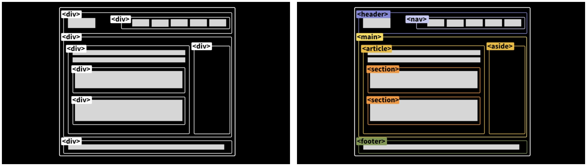

## 시맨틱 마크업이란

- "의미론적인"의 뜻을 가지며 마크업(Markup)이란 HTML 태그로 문서를 작성하는 것을 말한다. 
- 관련 태그로 `<table>`, `<header>`, `<footer>`, `<address>` 등이 있으며 개발자에게 태그를 통해 소스코드의 의미를 간접적으로 전달할 수 있다. 
- 브라우저는 태그를 통해 웹페이지를 더 쉽게 이해할 수 있게 된다. 
- 예를 들어 `<nav>` 태그가 있다면 네비게이션 역할을 하는 요소라는 것을 쉽게 알 수 있을 것이다.

## 작성 방법
- 헤더/푸터에 `<header>`와 `<footer>` 사용
- 메인 컨텐츠에 `<main>`과 `<section>` 사용
- 독립적인 컨텐츠에 `<article>` 사용
- 최상위 제목으로 `<h1>` 사용
- 순서가 없는 목록으로 `<ul>`과 `<li>` 사용
- 내비게이션에 `<nav>`사용

- CSS 스타일을 명시하는 태그를 사용하지 않는 것 또한 시맨틱 마크업의 한 종류이다.
- 태그가 가지는 의미 자체가 스타일이라면 이는 마크업 자체가 스타일을 갖는 것이기 때문에 시멘틱 마크업에 적합하지 않다.
> 동일한 효과를 부여하는 `<strong>`과 `<b>` 태그가 있다.   
> 둘은 동일하게 글자색을 진하게 하지만 `<b>` 태그의 경우는 그 자체가 "bold"의 약어이기 때문에 태그 자체가 스타일을 가진다고 할 수 있다.   
> 하지만 `<strong>`의 경우에는 "그 안의 내용이 다른 내용보다 더 강조되어야 한다"라는 의미를 가지기 때문에 시맨틱 마크업에 더 적합하다.  

## `<section>`과 `<article>`의 차이
- `<section>`은 보통 비슷한 특성의 컨텐츠를 담는 구역을 설정할 때 사용한다.
  - 예를 들어, header, footer 사이에 sidebar나 content를 담는 식이다.
- `<article>`은 관련성이 없고 독립적인 내용들을 담을 때 사용한다.
  - 예를 들어, section 안에서 서로 다른 기사들을 나열해야 할 때 각각의 기사를 article로 담는 식이다.

## 시맨틱 마크업 장점
- 접근성이 좋아진다.
- 검색엔진이 시맨틱 태그를 중요한 키워드로 간주하기 때문에 검색엔진 최적화(SEO)에 유리하다.
- 코드 가독성이 높아진다.