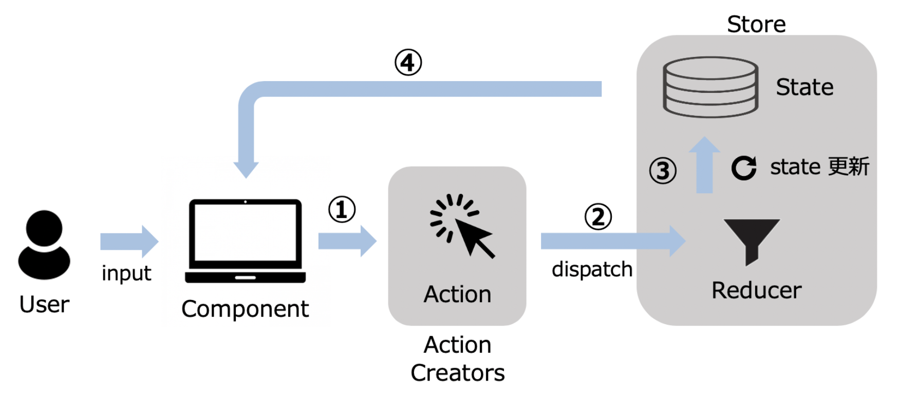

## Redux 흐름


1. ActionCreators에 의해 Action을 생성한다.

- 사용자의 입력에 의해 Component가 Action Creator함수에게 액션을 생성해 달라고 요청을 하고 Action Creator는 Action 객체를 반환한다.

```
ActionCreator : - 액션을 생성하는 함수다.
								- 액션 객체를 리턴한다.
Action : - 상태를 설정하기 위한 모든 요청은 액션을 통해 일어난다.
				 - type을 필수 property로 가지고 있다.
```

2. Action을 Dispatch한다.

- Action을 생성하는 것 만으로는 Store내의 State를 갱신할 수 없다.
- Dispatch하여 Action을 Store에 보낼 수 있습니다.

```
Dispatch : - Store의 내장 함수로 Action을 발생시키는 것이다.
           - Dispatch함수에 Action을 파라미터로 전달하여 Reducer로 보내진다.
```

3. Reducer에 의해 Store내의 State를 갱신한다

- Reducer는 Action을 기반으로 새로운 State 객체를 만들어 낸다.
- 각 Action의 type별로 처리 내용을 변경할 수 있습니다.

```
Reducer : - 액션을 받아 새로운 State 객체를 만들어 낸다.
Store : - 상태를 저장하는 곳이다.(도착지)
```

4. Store내의 State를 Component로 보내준다.
