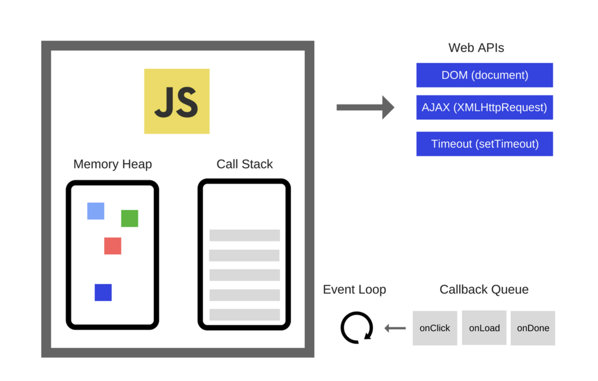
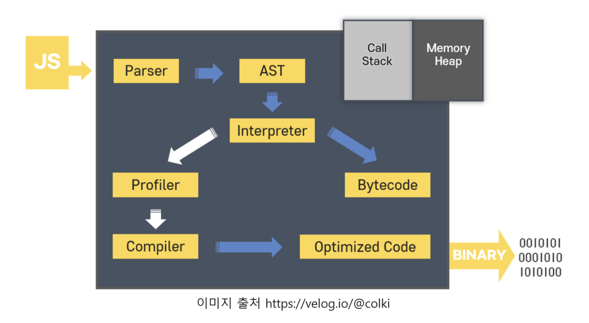

## JavaScript 동작 원리

1. 자바스크립트 동작 구조

- 자바스크립트를 실행하기 위해서는 자바스크립트 엔진이 필요하다.
- 대표적인 자바스크립트 엔진에는 구글에서 만든 V8엔진이다.

- 엔진은 Memory Heap, Call Stack으로 구성되어 있다.
  - Memory Heap(메모리 힘) : 메모리 할당이 발생한다.
  - Call Stack(호출 스택) : 코드 실행에 따라 스택이 하나씩 쌓이는 곳이다.
    > Web API : 웹 브라우저 혹은 node js 같은 자바스크립트 런타임에서 지원해주는 API
- 자바스크립트는 스택을 사용하기 때문에 후입 선출(LIFO)의 구조이다.
- 자바스크립트는 하나의 Call Stack을 가지고 코드를 순차적으로 처리하기 때문에 한 번에 하나의 명령어만 실행될 수 밖에 없다.
  - 단일(싱글) 스레드이며 동기식 언어라고 할 수 있다.
- 자바스크립트를 비동기로 수행하기 위해 Event Loop, Callback Queue가 필요하다.
- Event Loop는 Callback Queue에 있는 콜백 함수를 Call Stack으로 보내서 처리하기 위해 Call Stack이 비어있는지를 검사한다.
  - Call Stack이 비어있을 때 보내준다.
- 이벤트 루프가 반드시 Call Stack이 비어져있는 상태에서만 Call Stack으로 Push하는 이유는 자바스크립트라는 언어가 동기화 문제를 안는 것을 피하고 단일 스레드 언어라는 것을 보장해주기 위함이다.

1. 파서(Parser)

- 어휘 분석(Lexical Analysis)이라는 과정을 통해 코드를 토큰으로 분해한다.

2. 추상 구문트리(Abstract Syntax Tree, AST)

- 파서가 분해한 토큰으로 트리를 생성한다.

3. 추상 구문 트리에서 나온 코드를 인터프리터에 전달하고 인터프리터는 코드를 바이트코드로 변환한다.

- V8 에서는 인터프리터가 고급 언어로 작성된 소스 코드르 ㄹ가상 머신이 편하게 이해할 수 있게 바이트 코드로 컴파일한다.

4. 인터프리터가 코드를 실시간으로 변환하면서 브라우저에게 작업을 지시하는 동안 프로파일러가 최적화할 수 있는 부분을 찾아서 기록한다.

- 최적화가 가능한 부분을 찾으면 프로파일러는 이를 컴파일러에게 전달하고 컴파일러는 인터프리터에 의해 실시간으로 웹사이트가 구동되는 동안 필요한 부분을 기계어로 변환하여 최적화를 진행한다.

5. 컴파일러는 프로파일러에게 전달받은 내용을 토대로 기계어로 변환하여 최적화를 진행한다.
6. 최적화한 코드를 수행할 차례가 되면 바이트 코드 대신 최적화한 코드를 실행한다.
