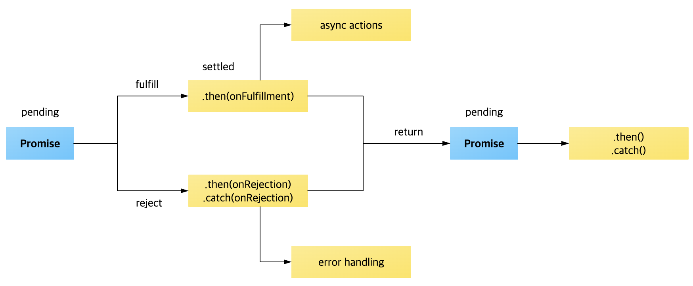

## Promise
- 비동기 작업이 완료된 이후에 다음 작업을 연결시켜 진행할 수 있다.
- 작업 결과 따라 성공 또는 실패를 리턴하며 결과 값을 전달 받을 수 있다.
- Promise객체를 통해 미리 함수를 등록해놓고, 결과에 따라서 resolve와 reject가 호출받으면, 함수를 실행하는 식이다.
- 마치 스위치를 내려 전기를 흐르게 하거나 올려서 안흐르게 하거나 같은 원리이다.

### 기본문법
```js
const myPromise = new Promise((resolve, reject) => { // 콜백함수
  // 구현..
  // resolve(값) or reject(값)
})
 
myPromise
   .then(n => {}) // 성공하면 콜백함수 실행. 인자 n은 resolve의 값. 리턴값은 Promise객체 (체이닝 가능)
   .catch(n => {}); // 실패하면 콜백함수 실행. 인자 n은 reject의 값. 리턴값은 Promise객체 (체이닝 가능)
```
### Promise의 3가지 상태 및 처리 흐름
- pending(대기) : 처리가 완료되지 않은 상태
- fulfilled(이행) : 성공적으로 처리가 완료된 상태
- rejected(거부) : 처리가 실패로 끝난 상태


> Promise 객체가 비동기 함수의 처리 상태를 보고 완료되었는지 판단하여 성공 여부에 따라 다음 처리를 다르게 수행할 수 있도록 해 준다.

### promise 흐름
- 프로미스 객체는 생성자를 사용해서 만들 수 있다.
- 생성자의 인자로 executor라는 함수를 이용한다.
- executor함수는 resolve와 reject를 인자로 가진다.
- 여기서 resolve와 reject는 각각 함수이다.
```js
new Promise( /*executor*/ (resolve, reject) => {...} );
```
- 생성자를 통해 프로미스 객체를 만드는 순간 pending(대기) 상태라고 한다.
- resolve함수를 실행하면, fulfilled(이행) 상태가 된다.
- reject함수를 실행하면, rejected(거부) 상태가 된다.
```js
new Promise((resolve, reject) => { //pending
	//... 비동기 처리
	resolve();  // fulfilled
    reject(); // rejected
});
```
- fulfilled된 시점에 p.then안에 설정한 callback함수가 실행된다.
```js
const p = new Promise((resolve, reject) => {
	/*pending*/
	setTimeout(() => {
		resolve(); /* fulfilled */
	}, 1000);
});
 
p.then(() => {
	/* resolve 된 이후에 실행됨*/ 
	/* callback */
	console.log('1000ms후에 fulfilled 됩니다.');
});
```
- then을 설정하는 시점을 명확히하고, 함수의 실행과 동시에 프로미스 객체를 만들면서 pending이 시작하도록 하기 위해 프로미스 객체 리턴하는 함수 p()를 만들어 p()호출과 동시에 then을 설정한다.
```js
function p() {
	return new Promise((resolve, reject) => {
		/*pending*/
		setTimeout(() => {
			reject(); /* rejected */
		}, 1000);
	});
}
 
//원하는 시점에 프로미스 객체를 생성하고 콜백함수도 호출할 수 있다.
p()
	.then(() => {
		console.log('1000ms후에 fulfilled 됩니다.');
	})
	.catch(() => {
		console.log('1000ms후에 rejected 됩니다.');
});
```
- resolve함수에 인자를 넣어 실행하면, then의 callback함수의 인자로도 받을 수가 있다.
```js
function p() {
	return new Promise((resolve, reject) => {
		setTimeout(() => {
			reject(new Error('error');
		}, 1000);
	});
}
 
//원하는 시점에 프로미스 객체를 생성하고 콜백함수도 호출할 수 있다.
p()
	.then(() => {
		console.log('1000ms후에 fulfilled 됩니다.');
	})
	.catch(reason => {
		console.log('1000ms후에 rejected 됩니다.', reason);
});
```
- 추가적으로 fulfilled 되거나 rejected된 후에 최종적으로 실행할 것이 있다면, .finally()를 설정하고, 함수를 인자로 넣는다.
```js
p()
	.then(() => {
		console.log('1000ms후에 fulfilled 됩니다.');
	})
	.catch(e => {
		console.log('1000ms후에 rejected 됩니다.', e);
	})
	.finally(() => { //finally는 resolve나 reject로 인자를 줄수없다. 무조건 빈함수
		console.log('end');
	});
```
### Promise가 필요한 이유
- 주로 서버에서 받아온 데이터를 화면에 표시할 때 사용한다.
- 웹 애플리케이션을 구현할 때 서버에서 데이터를 요청하고 받아오기 API를 사용하는데, 데이터를 받아오기도 전에 마치 데이터를 다 받아온 것 마냥 화면에 데이터를 표시하려고 하면 오류가 발생하거나 빈 화면이 뜨게 된다.

### Promise의 단점
- 에러를 잡을 때 몇번째에서 발생했는지 알아내기 어렵다.
- 특정 조건에 따라 분기를 나누는 작업도 어렵다.
- 특정 값을 공유해가면서 작업을 처리하기도 까다롭다.
- 이러한 문제점은 async/await을 사용하여 해결 할 수 있다.
