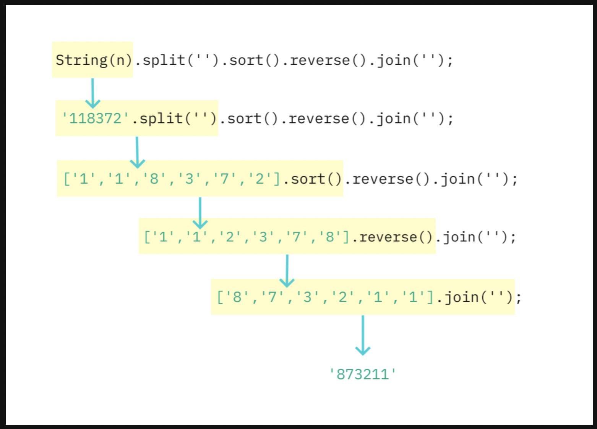

## Method Chaining
- 메서드가 객체를 반환하게 되면 메서드의 반환 값인 객체를 통해 또 다른 함수를 호출할 수 있다.

### 배열에서의 메서드 체이닝
```js
function solution(n) {
    return parseInt(String(n).split('').sort().reverse().join(''));
}
```


- 이전 메서드가 리턴하는 값에 다음에 연결된 메서드가 적용된다는 점이 메서드 체이닝의 핵심이다.
