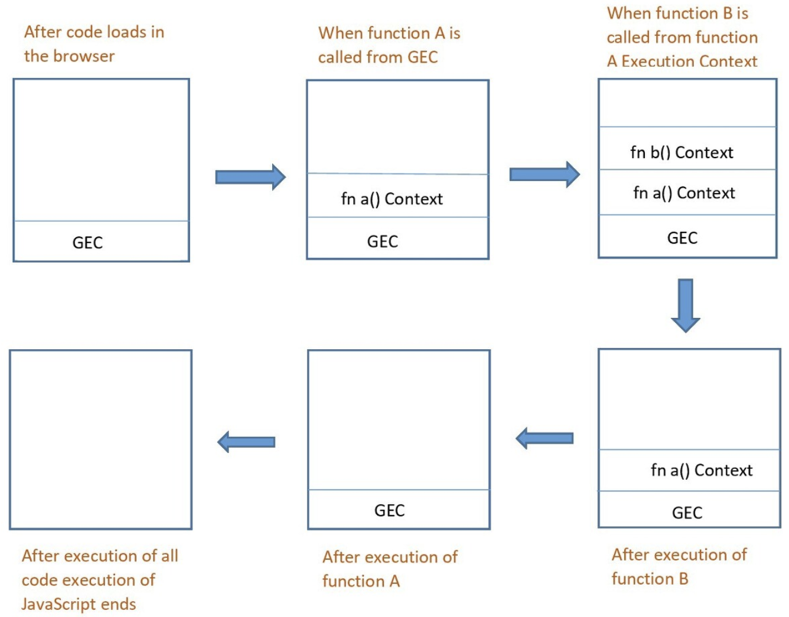

### 스코프 체인(Scope Chain)
- 일종의 리스트로서 전역 객체와 중첩된 함수의 스코프의 레퍼런스를 차례로 저장하고, 의미 그대로 각각의 스코프가 어떻게 연결(chain)되고 있는지 보여주는 것을 말한다.
- 자기 자신의 스코프(scope)를 제외한 자신과 가장 가까운 변수 객체의 모든 스코프들을 스코프 체인이라 할 수 있다.

### 실행 컨텍스트에서 스코프 체인(scope chain)은 어떻게 작동하는가?
- 실행 컨텍스트는 LIFO (Last in, First out) 구조의 스택으로, 코드 실행 중에 생성된 모든 실행 컨텍스트를 저장하는 데 사용된다.
- 실행 컨텍스트가 실행되면, 엔진이 스코프 체인을 통해 렉시컬 스코프를 먼저 파악한다.
- 함수가 중첩 상태일 때 하위 함수 내에서 상위 함수의 스코프와 전역 스코프까지 참조할 수 있는데 이것을 스코프 체인을 통해 탐색하는 것이다.
```js
var v = "전역 변수";

function a() {
//function a Execution Context(EC)
	var v = "지역 변수";
    
    function b() {
    	//function b Execution Context
    	console.log(v);
    }
    
    b();
}

//Global Execution Context
a();
```


- 글로벌 실행 컨텍스트(GEC)가 실행되고 스택에 쌓인다.
- 함수 호출 순으로 실행 컨텍스트 스택에 쌓이게 되고, 가장 나중에 호출된 b() 함수가 실행 컨텍스트 안에서부터 탐색을 시작한다.
- b() 함수 안에서 변수 v를 탐색하기 시작하는데, 만약 변수 v가 없으면 b() 함수를 감싸고 있는 외부 함수 a() 함수를 탐색하기 시작한다.
- a() 함수 안에 변수 v가 존재하면 안에 있는 v를 참조하게 되고, 만약 없다면 마지막으로 전역 객체를 탐색하여 v를 찾아낸다.
- 결국 찾지 못한다면, v가 없다고 VM500:1 Uncaught ReferenceError: v is not defined라는 에러를 보게 될 것이다.
- 반대로 찾았다면, 결과값은 a() 안에 변수 v가 존재하기 때문에 지역 변수라는 값이 출력이 된다.
- 만약, a() 함수 안에 변수 v를 제거한다면 전역 객체에 있는 변수 v의 값 전연 변수가 출력이 될 것이다.
- 이러한 과정들이 스코프에 담긴 순서대로 탐색하는 스코프 체인이다.
