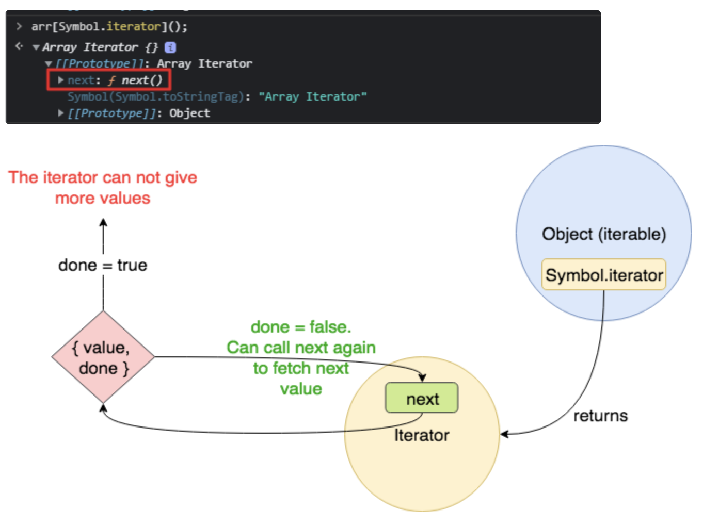

## 이터러블(iterable)

- 자료를 반복할 수 있는 객체를 말한다.
- 이터레이터를 리턴하는 `[Symbol.iterator]()`메서드를 가진 값이다.
- array, Set, Map은 이터러블이다.(이터레이터를 리턴하는 `[Symbol.iterator]()`메서드를 가졌기 때문이다.)

```js
let arr = [1, 2, 3]
for (const a of arr) console.log(a) // 정상작동 1,2,3

arr[Symbol.iterator] = null // 이렇게 하면 순회가 되지 않는다
for (const a of arr) console.log(a) // Uncaught TypeError: arr is not iterable
```

- 이터러블 표식이 없어져 멀쩡한 배열임에도 불구하고 for of로 순회할 수 없다.

## 이터레이터

- {value : 값 , done : true/false} 형태의 이터레이터 객체를 리턴하는 next() 메서드를 가진 객체이다.
- next 메서드로 순환 할 수 있는 객체다.
- `[Symbol.iterator]()` 안에 정의 되어있다.

```js
const arr = [1, 2, 3] //arr는 그냥 평범한 배열

const iter = arr[Symbol.iterator]()
/*
문법 파헤치기 : key값을 문자열이 아닌 변수로 주기위해 arr[변수] 형태를 가진다.
위 사진에서 보듯이, Symbol.iterator 라는 key값을 가지고 value는 함수이다. 
이를 접근해서 함수실행() 시키면 이터레이터 객체가 반환되어 iter에 담기게 된다.
*/

iter.next()
//>{value:1,done: false}
iter.next()
//>{value:2, done: false},
iter.next()
//{value:3, done: false}
iter.next()
//{value: undefined, done: true}
```

## 이터러블 / 이터레이터 프로토콜

- 이터러블을 for...of, 전개 연산자 등과 함께 동작하도록한 규약이다.
- 이터러블이란 이터러블 규약을 따르는 객체이다.
  
