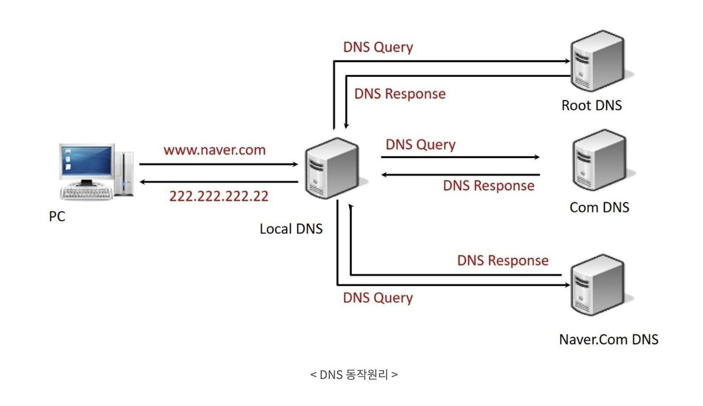

## DNS

- 실제 naver. com 서버는 숫자로 구성된 IP 주소로 통신하지만, 우리는 기억하기 쉬운 도메인 이름을 사용하는 것이다.
- 우리가 입력한 도메인 주소(www. naver .com)를 숫자인 IP 주소로 변환하는 과정이 필요한데 이것을 담당하는 시스템이다.
- 길고 복잡한 IP 주소를 외울수가 없기 때문에 문자 주소를 사용하기 위해 DNS를 사용하게 됩니다.

### DNS 구성 요소

1. 도메인 네임 스페이스 (Domain Name Space)

- 최상위에 루트 DNS 서버가 존재하고, 그 하위로 인터넷에 연결된 모든 노드가 연속해서 이어진 계층구조로 구성

2. 네임 서버 (Name Server)

- 주소를 변환 시키기 위해 도메인 네임 스페이스의 트리구조에 대한 정보가 필요. 이 정보를 가진 서버 도메인 이름을 IP주소로 변환하는 것을 네임 서비스

3. 리졸버 (Resolver)

- DNS클라이언트의 요청을 네임 서버로 전달하고 네임 서버로부터 도메인이름과 IP 주소를 받아 클라이언트에게 제공하는 기능을 수행

### 동작 원리

1. DNS Query (from Web Browser to Local DNS)

- "제가 원하는 웹 사이트의 IP 주소를 알고 계신가요?" Local DNS 서버에게 전달

2. DNS Query (from Local DNS to Root DNS)

- "제가 원하는 웹 사이트의 IP 주소를 알고 계신가요?" Root DNS서버에게 전달

3. DNS Response (from Root DNS to Local DNS)

- "저는 모르지만 , Com 도메인을 관리하는 네임서버의 이름과 IP 주소를 알려드릴 테니 거기에 물어보세요"

4. DNS Query (from Local DNS to com NS)

- “안녕하세요. www. naver. com의 IP 주소를 알고 계신가요?"

5. DNS Response (from com NS to Local DNS)

- "저는 모르지만 , Com 도메인을 관리하는 네임서버의 이름과 IP 주소를 알려드릴 테니 거기에 물어보세요"

6. DNS Query (from Local DNS to naver. com NS)

- “안녕하세요. www. Naver .com의 IP 주소를 알고 계신가요?"

7. DNS Response (from naver .com NS to Local DNS)

- "저는 모르지만 해당 웹은 www. g.naver. com이라는 이름으로 통해요. g.naver .com 도메인을 관리하는 네임서버의 이름과 IP 주소를 알려드릴테니 거기에 물어보세요"

8. DNS Query (from Local DNS to g.naver. com NS)

- “안녕하세요. www. g.naver. com의 IP 주소를 알고 계신가요?"

9. DNS Response (from g.naver .com NS to Local DNS)

- "네 www. g.naver .com의 IP 주소는 222.222.222.22와 333.333.333.33입니다"

10. DNS Response (from Local DNS to Web Browser)

- "네 www. naver .com의 IP 주소는 222.222.222.22와 333.333.333.33입니다"
