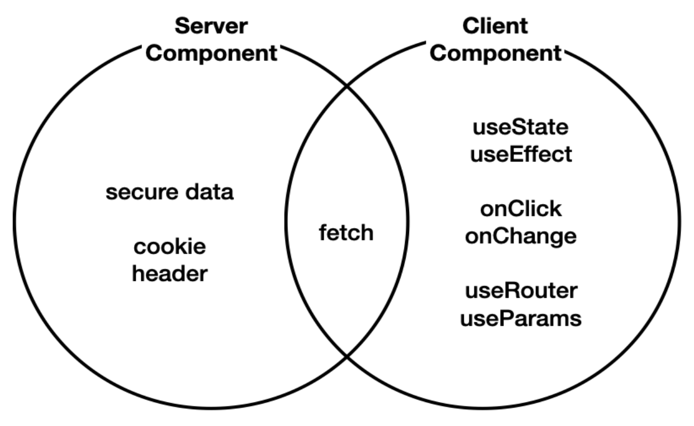

# Server Component & Client Component

- NextJS에서는 ServerComponent, ClientComponent 개념이 구분되어있다.
- React 18version부터 ServerComponent개념이 추가되었다.
- NextJS에서는 특별한 처리를 하지 않으면 ServerComponent로 간주한다.
- 정보를 표현하는데 사용자와 상호작용을 하지 않는다면 ServerComponent로 만드는 것이 유리하다.
- 사용자와 상호작용하는 부분은 ClientComponent를 사용하는 것이 좋다.

- 서버 컴포넌트는 모든 작업을 서버 쪽에서 처리하고, 그 결과인 html 코드만 클라이언트로 전송합니다.
- 이것을 서버쪽에서 랜더링을 한다고해서 server side rendering이라고 한다.

### SSR이 좋은 점

- 간결한 코드:
  - useEffect와 useState와 같은 훅을 사용하지 않아도 되므로, 코드가 더 간결하고 이해하기 쉬워진다.
  - 이로 인해 코드 유지 관리가 쉬워지고, 버그 발생 확률이 줄어들 수 있다.
- 빠른 데이터 엑세스:
  - 데이터베이스와 같은 자원에 접근해야 하는 경우, 서버 컴포넌트는 서버와 데이터베이스가 가까운 위치에서 작동하므로, 더 빠른 속도로 필요한 데이터에 접근할 수 있다.
- 보안:
  - 서버 컴포넌트는 클라이언트에 민감한 정보(예: 데이터베이스 비밀번호)를 전송하지 않는다.
  - 이로 인해, 필요한 작업을 안전하게 처리하면서 동시에 클라이언트의 보안을 유지할 수 있다.
- 향상된 성능:
  - 서버 컴포넌트는 클라이언트로 JavaScript 코드를 전송하지 않는다.
  - 이는 전송되는 데이터의 양을 줄이고, 클라이언트의 부하를 줄임으로써 웹사이트의 전반적인 성능을 향상시키는데 도움이 된다.
