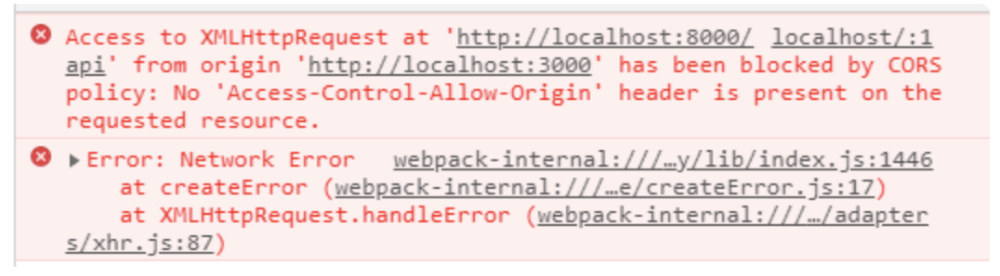
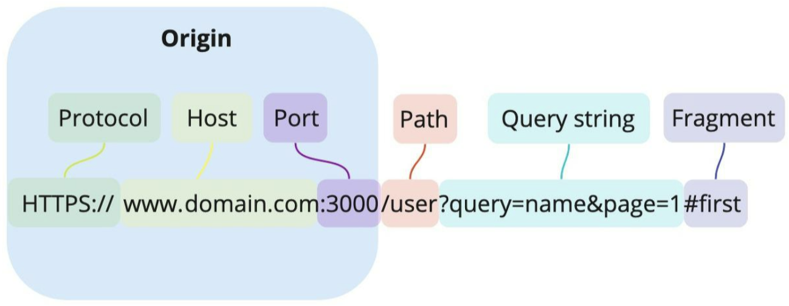

## CORS(Cross Origin Resource Sharing)

- 우리가 가져오는 리소스들이 안전한지 검사하는 관문이다.



```
'https://api.lubycon.com/me'에서 오리진 'https://localhost:3000'으로 가져올 수 있는 액세스가 CORS 정책에 의해 차단되었습니다. 요청된 리소스에 'Access-Control-Allow-Origin' 헤더가 없습니다. 불투명한 응답이 필요에 적합한 경우, 요청 모드를 '노코어'로 설정하여 CORS가 비활성화된 리소스를 가져오십시오.
```

- HTTP 요청에 대해서 어떤 요청을 하느냐에 따라 각기 다른 특징을 가지고 있다.
- HTML 은 기본적으로 Cross-Origin정책을 따른다.
  - link 태그에서 다른 origin의 css 등의 리소스에 접근하는 것이 가능하다.
  - img 태그등에서 다른 리소스에 접근하는 것이 가능하다.
- XMLHttpRequest, Fetch API 등 script 태그 내에서는 기본적으로 Same-Origin 정책을 따른다.
  - 자바스크립트는 서로 다른 도메인에 대한 요청을 보안상 제한한다. (브라우저 기본 설정은 하나의 서버 연결만 허용)
  - 이 정책을 Same-Origin-Policy라고 한다.

## 출처(Origin) 란



- 출처는 Protocol과 Host 그리고 Port까지 모두 합친 것을 의미한다.
- 자바스크립트로 Location 객체가 가지고 있는 origin 프로퍼티에 접근하여 현재 출처를 알아낼 수도 있다.

```js
console.log(location.origin)
```

## Cross Origin / Same Origin

- 웹에는 SOP(Same Origin Policy)와 CORS(Cross Origin Resurce Sharing) 두가지 정책이 있다.

### SOP(Same-Origin Policy) - 동일 출처 정책

- 같은 출처에서만 리소스를 공유할 수 있다라는 규칙을 가진 정책이다.
- 두개의 출처를 비교하는 방법은 URL의 구성요소 중 Protocol, Host, Port 이 세가지가 동일한지 확인하면 된다.
- 같은 프로토콜, 호스트, 포트를 사용한다면 다른 요소는 다르더라도 같은 출처로 인정된다.
- 리소스가 자신의 출처와 다를경우 브라우저는 교차출처 요청을 실행한다.
- 출처를 비교하는 로직은 서버에 구현된 스펙이 아닌 브라우저에 구현된 스펙이다.
- 만약 CORS정책을 위반하는 요청에 서버가 정상적으로 응답을 하더라도 브라우저가 이 응답을 분석해서 CORS정책에 위반되면 그 응답은 처리하지 않게 된다.
- 프로토콜, 포트, 호스트중 하나라도 일치하지 않으면 Cross Origin 이라고 한다.

### CORS(Cross-Origin Resource Sharing) - 교차&다른 출처 리소스 공유

- 추가 HTTP 헤더를 사용하여, 한 출처에서 실행 중인 웹 애플리케이션이 다른 출처의 선택한 자원에 접근할 수 있는 권한을 부여하도록 브라우저에 알려주는 체제다.
- 웹 애플리케이션은 리소스가 자신의 출처(도메인, 프로토콜, 포트)와 다를 때 교차 출처 HTTP 요청을 실행하게 된다.

### CORS 기본 동작과정

1. 클라이언트에서 HTTP요청의 헤더에 Origin을 담아 전달한다.

- 다른 Origin의 리소스 요청시 클라이언트는 HTTP요청을 보낸다.
- 이때 요청헤더의 Origin필드에는 요청을 보내는 Origin을 담아보낸다.

2. 서버는 응답헤더에 Access-Control-Allow-Origin을 담아 클라이언트로 전달한다.

- 서버가 응답을 보낼때, 허락하는 Origin을 클라이언트에게 전달한다.

3. 클라이언트에서, 자신이 보냈던 요청의 Origin과 서버가 보내준 Access-Control-Allow-Origin을 비교한다.

- 자신이 보낸 Origin과 서버가 보내준 Access-Control-Allow-Origin을 비교하여 차단할지 말지를 결정한다.
- 만약 유효하지 않다면 그 응답을 사용하지 않고 버린다.

### CORS의 3가지 시나리오

1. 예비 요청(Preflight Request)

- 브라우저는 요청을 한번에 보내지 않고, 예비 요청과 본요청으로 나누어 서버에 전달한다.
- 브라우저가 예비 요청을 보내는 것을 Preflight라고 부르며 예비 요청의 메소드에는 OPTIONS가 사용된다.
- 예비 요청의 역할은 본 요청을 보내기 전에 브라우저 스스로 안전한 요청인지 확인하는 것이다.
  1. 자바스크립트의 fetch API를 통해 브라우저에게 리소스를 받아오려고 한다.
  2. 브라우저는 서버로 예비요청을 먼저 보낸다.
  3. 서버는 이 예비요청에 대한 응답으로 어떤 것을 허용하고 어떤것을 금지하고 있는지에 대한 정보를 담아서 브라우저로 다시 보내준다.
  4. 이후 브라우저는 보낸 요청과 서버가 응답해준 정책을 비교하여 해당 요청이 안전한지 확인하고 본 요청을 보내게 된다.
  5. 이후 서버가 본 요청에 대한 응답을 하면 최종적으로 이 응답 데이터를 자바스립트로 넘겨준다.

2. 단순 요청(Simple Request)

- 단순 요청은 예비 요청(Prefilght)을 보내지 않고 바로 서버에 본 요청을 한 후, 서버가 이에 대한 응답의 헤더에 Access-Control-Allow-Origin과 같은 같을 보내주면 브라우저가 CORS정책 위반 여부를 검사하는 방식이다.
- Simple Request를 사용한다는 것은 예비요청을 생략한다는 뜻이다.
- 예비 요청 생략은 3가지 경우를 만족할때만 가능하다.
  - 요청의 메소드는 GET, HEAD, POST중 하나여야 한다.
  - 유저 에이전트가 자동으로 설정한 헤더외에, 수동으로 설정할 수 있는 헤더는 Fetch 명세에서 "CORS-safelisted request-header"로 정의한 헤더만 사용할 수 있다.
    (Accept, Accept-Language, Content-Language, Content-Type, DPR, Downlink, Save-Data, Viewport-Width, Width)
  - Content-Type 을 사용하는 경우에는 다음의 값들만 허용된다.
    (application/x-www-form-urlencoded, multipart/form-data, text/plain)

3. 인증된 요청(Credentialed Request)

- 기존 예비요청에서 보안을 더 강화하고 싶을 때 사용한다.
- 기본적으로 브라우저가 제공하는 비동기 리소스 요청 API인 XMLHttpRequest 객체나 fetch API는 별도의 옵션 없이 브라우저의 쿠키 정보나 인증과 관련된 헤더를 함부로 요청에 담지 않는다.
- credentials 옵션은 요청에 인증과 관련된 정보를 담을 수 있게 해주는 옵션이다.
  - same-origin(기본값) : 같은 출처 간 요청에만 인증 정보를 담을 수 있다.
  - include : 모든 요청에 인증 정보를 담을 수 있다.
  - omit : 모든 요청에 인증 정보를 담지 않는다.

```js
fetch('http://localhost:3001/cors', {
method: 'PUT',
credentials: 'include' // credentials 옵션
})
.then(function(response) {
  ... 코드
})
.catch(function(error) {
  ... 코드
})
```

- same-origin 이나 include와 같은 옵션을 사용하여 리소스 요청에 인증 정보가 포함된다면, 브라우저는 다른 출처의 리소를 요청할 때 Access-Control-Allow-Origin만 확인하는 것이 아니라 다른 조건을 추가로 검사한다.
- 요청에 인증정보가 담겨있는 상태에서 다른 출처의 리소스를 요청하게 되면, 브라우저는 CORS정책 위반 여부를 검사하는 룰에 다음 두가지를 추가하게 된다.
  - Access-Control-Allow-Origin 에는 모든 요청을 허용하는 \* 을 사용할 수 없으며, 명시적인 URL이어야 한다.
  - 응답 헤더에는 반드시 Access-Control-Allow-Credentials: true가 존재해야 한다.

### CORS 해결 방법

1. Chrome 확장 프로그램 이용

- 'Allow CORS: Access-Control-Allow-Origin' 을 설치 해준다.
- 해당 프로그램을 활성화 시키게 되면, 로컬 환경에서 API를 사용 시, CORS 문제를 해결할 수 있다.

2. 서버에서 Access-Control-Allow-Origin 세팅하기

```js
// CORS 허용
res.setHeader('Access-Control-Allow-origin', 'https://aaaa.bbbb.com')
res.setHeader('Access-Control-Allow-Credentials', 'true') // 쿠키 주고받기 허용
```

- 헤더의 Access-Control-Allow-설정

```js
// 헤더에 작성된 출처만 브라우저가 리소스를 접근할 수 있도록 허용함.
Access-Control-Allow-Origin: <https://naver.com>
// 리소스 접근을 허용하는 HTTP 메서드를 지정해 주는 헤더
Access-Control-Request-Methods: GET, POST, PUT, DELETE
// 서버에서 응답 헤더에 추가해 줘야 브라우저의 자바스크립트에서 헤더에 접근 허용
Access-Control-Expose-Headers: Authorization
// preflight 요청 결과를 캐시 할 수 있는 시간을 나타냄.
// 60초 동안 preflight 요청을 캐시하는 설정으로, 첫 요청 이후 60초 동안은 OPTIONS 메소드를 사용하는 예비 요청을 보내지 않는다.
Access-Control-Max-Age: 60
// 자바스크립트 요청에서 credentials가 include일 때 요청에 대한 응답을 할 수 있는지를 나타낸다
Access-Control-Allow-Credentials: true
```
