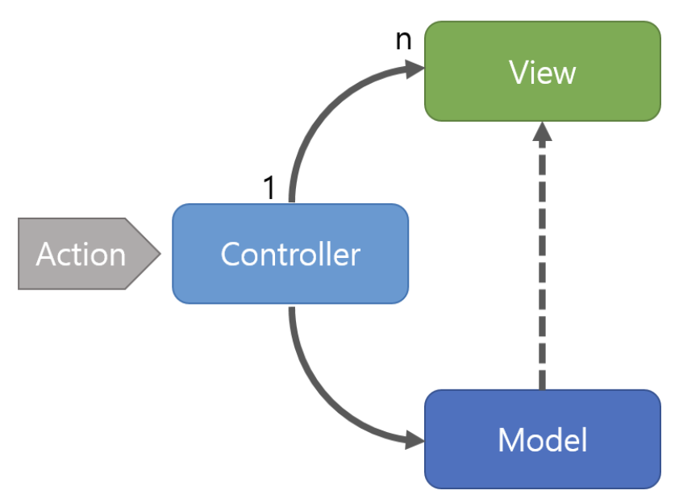
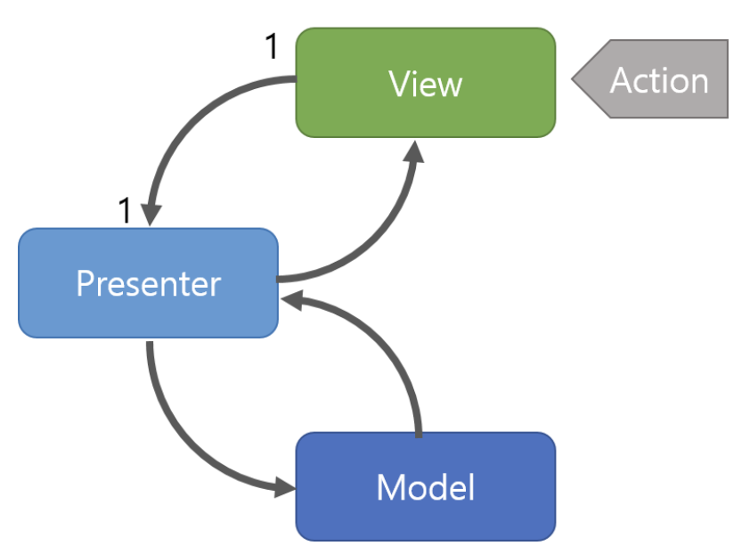
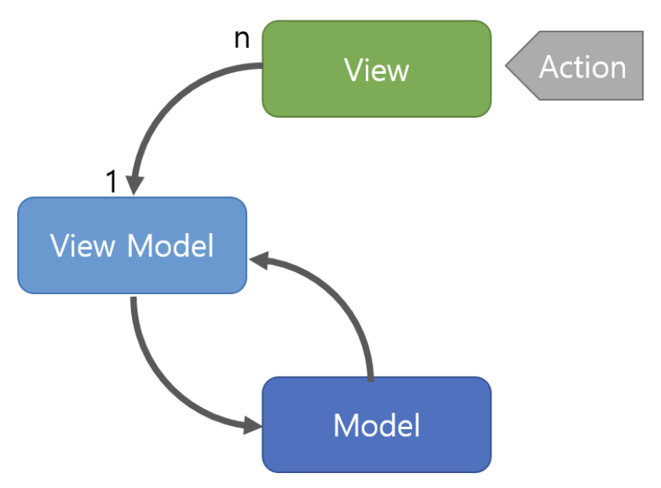

## MVC & MVP & MVVM 비교
- 역할을 분리하는 이유는 각각의 역할을 나눠 코드 관리를 하기 위해서 이다.
- 역할을 나누어 관리가 된다면 유지보수와 개발 효율이 좋아진다.

### MVC
- Model + View + Controller를 합친 용어이다.

1. 구조

- Model : 어플리케이션에서 사용되는 데이터와 그 데이터를 처리하는 부분이다.
- View : 사용자에서 보여지는 UI 부분이다.
- Controller : 사용자의 입력(Action)을 받고 처리하는 부분이다.

2. 동작 순서
- 사용자의 Action들은 Controller에 들어오게 된다.
- Controller는 사용자의 Action를 확인하고, Model을 업데이트한다.
- Controller는 Model을 나타내줄 View를 선택한다.
- View는 Model을 이용하여 화면을 나타낸다.
    - 참고 :: MVC에서 View가 업데이트 되는 방법
        - View가 Model을 이용하여 직접 업데이트 하는 방법
        - Model에서 View에게 Notify 하여 업데이트 하는 방법
        - View가 Polling으로 주기적으로 Model의 변경을 감지하여 업데이트 하는 방법

3. 특징
- Controller는 여러개의 View를 선택할 수 있는 1:n 구조이다.
- Controller는 View를 선택할 뿐 직접 업데이트 하지 않는다. (View는 Controller를 알지 못한다.)

4. 장점
- 널리 사용되고 있는 패턴이라는 점에 걸맞게 가장 단순하다.

5. 단점
- View와 Model 사이의 의존성이 높다는 것이다.
- View와 Model의 높은 의존성은 어플리케이션이 커질 수록 복잡하지고 유지보수가 어렵게 만들 수 있다.

### MVP
- Model + View + Presenter를 합친 용어이다.
- Model과 View는 MVC 패턴과 동일하고, Controller 대신 Presenter가 존재한다.
1. 구조

- Model : 어플리케이션에서 사용되는 데이터와 그 데이터를 처리하는 부분이다.
- View : 사용자에서 보여지는 UI 부분이다.
- Presenter : View에서 요청한 정보로 Model을 가공하여 View에 전달해 주는 부분이다.(View와 Model을 붙여주는 접착제..? 역할을 한다.)

2. 동작 순서
- 사용자의 Action들은 View를 통해 들어오게 된다.
- View는 데이터를 Presenter에 요청한다.
- Presenter는 Model에게 데이터를 요청한다.
- Model은 Presenter에서 요청받은 데이터를 응답한다.
- Presenter는 View에게 데이터를 응답한다.
- View는 Presenter가 응답한 데이터를 이용하여 화면을 나타낸다.

3. 특징
- Presenter는 View와 Model의 인스턴스를 가지고 있어 둘을 연결하는 접착제 역할을 한다.
- Presenter와 View는 1:1 관계이다.

4. 장점
- View와 Model의 의존성이 없다는 것이다.
- MVC 패턴의 단점이었던 View와 Model의 의존성을 해결했다. (Presenter를 통해서만 데이터를 전달 받기 때문에..)

5. 단점
- MVC 패턴의 단점인 View와 Model 사이의 의존성은 해결되었지만, View와 Presenter 사이의 의존성이 높은 가지게 되는 단점이 있다.
- 어플리케이션이 복잡해 질 수록 View와 Presenter 사이의 의존성이 강해지는 단점이 있다.

### MVVM
Model + View + View Model를 합친 용어이다. Model과 View은 다른 패턴과 동일하다.

1. 구조

- Model : 어플리케이션에서 사용되는 데이터와 그 데이터를 처리하는 부분이다.
- View : 사용자에서 보여지는 UI 부분이다.
- View Model : View를 표현하기 위해 만든 View를 위한 Model이다. View를 나타내 주기 위한 Model이자 View를 나타내기 위한 데이터 처리를 하는 부분이다.

2. 동작 순서
- 사용자의 Action들은 View를 통해 들어오게 된다.
- View에 Action이 들어오면, Command 패턴으로 View Model에 Action을 전달한다.
- View Model은 Model에게 데이터를 요청한다.
- Model은 View Model에게 요청받은 데이터를 응답한다.
- View Model은 응답 받은 데이터를 가공하여 저장한다.
- View는 View Model과 Data Binding하여 화면을 나타낸다.

3. 특징
- Command 패턴과 Data Binding 두 가지 패턴을 사용하여 구현되었다.
- Command 패턴과 Data Binding을 이용하여 View와 View Model 사이의 의존성을 없앴다.
- View Model과 View는 1:n 관계이다.

4. 장점
- View와 Model 사이의 의존성이 없다.
- Command 패턴과 Data Binding을 사용하여 View와 View Model 사이의 의존성 또한 없앤 디자인패턴이다.
- 각각의 부분은 독립적이기 때문에 모듈화 하여 개발할 수 있다.

5. 단점
- View Model의 설계가 쉽지 않다는 점이다.